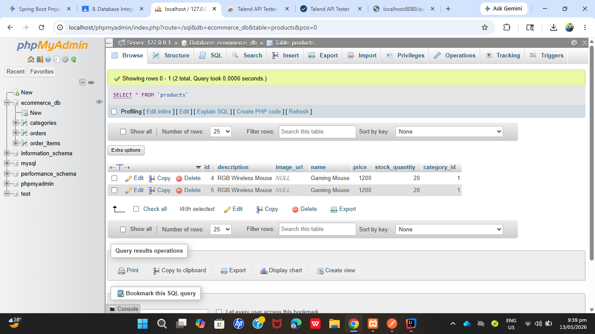
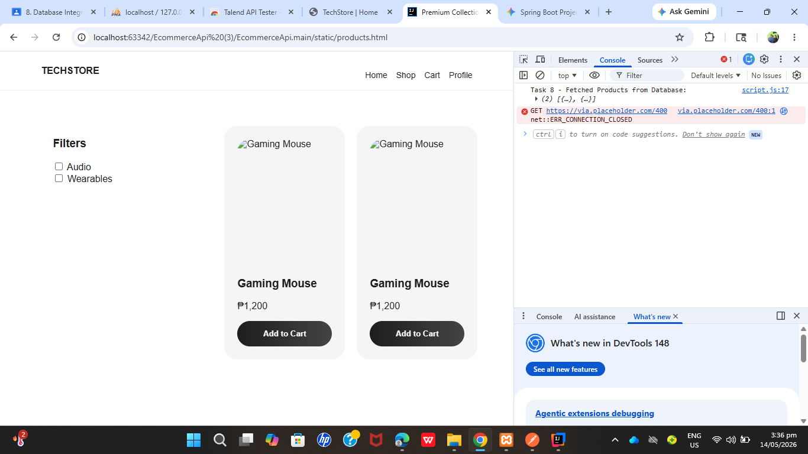

# TechStore E-Commerce Project (LABORATORY 8)

---

## 🚀 Task 9: Documentation & Submission

### 📊 Database Schema
Our system uses a relational database structure to manage products and order consistency.
* **Table:** `products`
   * `id` (Primary Key, Long): Unique identifier for each product.
   * `name` (String): The name of the tech product.
   * `price` (Double): The unit price in PHP.
   * `description` (Text): Detailed product information.
   * `image_url` (String): Path or URL to the product image.
   * `category` (String): Product classification (e.g., Audio, Wearables).

### 🔌 API Endpoints
The following endpoints are implemented in the Spring Boot backend:

| Method | Endpoint | Description |
| :--- | :--- | :--- |
| **GET** | `/api/products` | Fetches all products from the database. |
| **GET** | `/api/products/{id}` | Fetches a specific product by its ID. |

### 📸 Evidence of Success

#### Database Table


#### Browser Console Fetch



## 📝 Code Quality & Logic
* **JPA Entities:** Documented with Javadoc to explain fields and table mapping.
* **JavaScript Fetch:** Implemented with `try/catch` blocks for robust error handling and API connectivity verification.

# 🛒 Ecommerce API Project (LABORATORY 7)

## 📝 Project Overview
This project is a **Spring Boot REST API** developed for managing product information in an e-commerce system. It features a complete set of CRUD (Create, Read, Update, Delete) operations and specialized filtering logic. This application was built as part of the **WS101 (Web Systems and Technologies)** laboratory requirements.

## 🚀 Technologies Used
* **Java 17**
* **Spring Boot 3.x** (Web & Validation Starter)
* **Gradle** (Build Automation)
* **In-Memory Storage** (Java ArrayList)
* **Git** (Version Control)

## 🛠️ Setup & Installation
1. **Clone the Repository:**
   ```bash
   git clone <https://github.com/bitneigh/PINUELA-PAJANOSTAN->

## 📌 API Endpoints Reference

| Method | Endpoint | Description | Expected Status |
| :--- | :--- | :--- | :--- |
| **GET** | `/api/v1/products` | Get all products | 200 OK |
| **GET** | `/api/v1/products/{id}` | Get product by ID | 200 OK / 404 |
| **GET** | `/api/v1/products/filter` | Filter by category | 200 OK |
| **POST** | `/api/v1/products` | Create new product | 201 Created |
| **PUT** | `/api/v1/products/{id}` | Update product | 200 OK / 404 |
| **DELETE** | `/api/v1/products/{id}` | Delete product | 204 No Content |
---


## 👥 Contributors
* **Britney Ashley Pinuela** - *Lead Developer / Documentation*
* **Stephanie Pajanostan** - *Pair Programmer / Quality Assurance*

> **Pair Programming Session:** This project was developed collaboratively.
> 
> Co-authored-by: Britney Ashley Pinuela <bitneighpinuela@gmail.com>
> 
> Co-authored-by: Stephanie Pajanostan <pajanostanstephanie15@gmail.com>

## 🧪 Sample Request & Response (Validation Test)
To verify the validation logic and exception handling, use this cURL command:

**Request:**
```bash
curl -X POST http://localhost:8080/api/v1/products -H "Content-Type: application/json" -d "{\"name\":\"Test\",\"description\":\"Test\",\"price\":-50.0,\"category\":\"Tech\",\"stockQuantity\":1}"